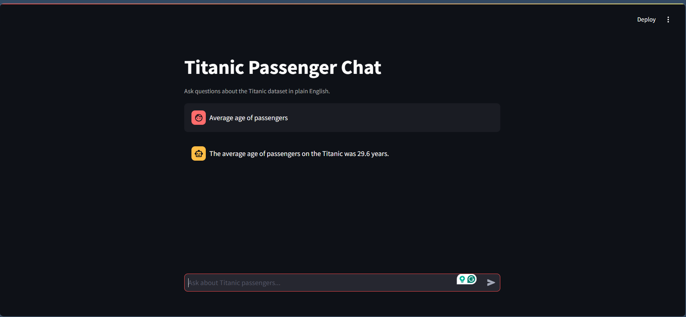
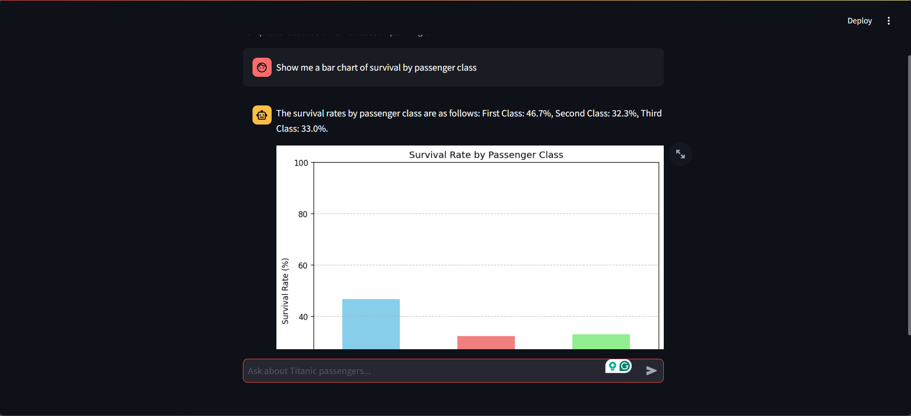
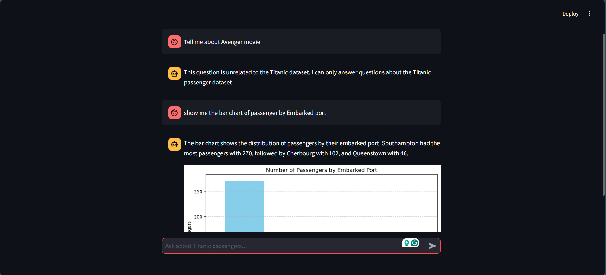

# 🚢 Titanic Dataset Chat Agent

> **AI-Powered Conversational Data Analysis with LangChain + FastAPI + Streamlit**


A complete end-to-end conversational AI agent for exploring the Titanic passenger dataset. Ask questions in plain English, get accurate statistics, and view auto-generated charts — all through a clean chat interface.

---

## ✨ Features

- 💬 **Natural Language Queries** — Ask anything about the dataset in plain English
- 📊 **Auto-Generated Charts** — Bar charts, histograms, pie charts rendered on demand
- 🤖 **LangChain Pandas Agent** — Writes and executes Python code to answer queries
- ⚡ **FastAPI Backend** — Clean REST API with `/chat` and `/dataset-info` endpoints
- 🖥️ **Streamlit Frontend** — Simple, responsive chat UI with sidebar stats
- 🔁 **Error Recovery** — Extracts valid answers even when Gemini output parsing fails

---

## 📸 App in Action

<table>
  <thead>
    <tr>
      <th align="center">Image 1</th>
      <th align="center">Image 2</th>
      <th align="center">Image 3</th>
    </tr>
  </thead>
  <tbody>
    <tr>
      <td align="center">
        
      </td>
      <td align="center">
        
      </td>
      <td align="center">
        
      </td>
    </tr>
  </tbody>
</table>

## 🏗️ Architecture

```
┌──────────────────────────┐        POST /chat        ┌──────────────────────────────┐
│    Streamlit Frontend    │ ──────────────────────►  │      FastAPI Backend         │
│      (frontend.py)       │ ◄──────────────────────  │        (main.py)             │
│                          │  {answer, chart_image}   │                              │
│  • st.chat_input         │                          │  • LangChain Pandas Agent    │
│  • st.chat_message       │                          │  • Gemini 2.5 Flash LLM      │
│  • st.image for charts   │                          │  • matplotlib chart saving   │
│  • Sidebar stats         │                          │  • Base64 image encoding     │
└──────────────────────────┘                          └──────────────────────────────┘
```

---

## 📁 Project Structure

```
titanic-agent/
├── main.py                  # FastAPI backend + LangChain agent
├── frontend.py              # Streamlit chat UI
├── titanic_cleaned.csv      # Cleaned Titanic dataset
├── requirements.txt         # Python dependencies
├── .env                     # API keys (never commit this)
├── .env.example             # Template for environment variables
├── .streamlit/
│   ├── config.toml          # Streamlit theme config
│   └── secrets.toml         # Streamlit Cloud secrets template
└── static/                  # Auto-created folder for static files
```

---

## ⚡ Quick Start

### 1. Clone & Install

```bash
git clone https://github.com/your-username/titanic-chat-agent.git
cd titanic-chat-agent
pip install -r requirements.txt
```

### 2. Set Your API Key

```bash
cp .env.example .env
```

Edit `.env`:
```env
GEMINI_API_KEY=your-gemini-api-key-here
```

Get a free Gemini API key at [aistudio.google.com](https://aistudio.google.com)

### 3. Start the Backend

```bash
uvicorn main:app --reload --port 8000
```

### 4. Start the Frontend

```bash
streamlit run frontend.py
```

Open **http://localhost:8501** in your browser.

---

## 💬 Example Questions

| Category | Question |
|---|---|
| Demographics | `What percentage of passengers were male?` |
| Visualization | `Show me a histogram of passenger ages` |
| Statistics | `What was the average ticket fare?` |
| Geography | `How many passengers embarked from each port?` |
| Survival | `Show me a bar chart of survival by passenger class` |
| Gender | `What was the survival rate for women vs men?` |
| Children | `How many children under 10 survived?` |
| Fare | `Show the fare distribution` |

---

## 🛠️ Tech Stack

| Layer | Technology | Purpose |
|---|---|---|
| Frontend | Streamlit 1.35 | Chat UI, chart display |
| Backend | FastAPI + Uvicorn | REST API server |
| AI Agent | LangChain `create_pandas_dataframe_agent` | Interprets English → runs Pandas code |
| LLM | Google Gemini 2.5 Flash | Language understanding |
| Data | Pandas | Dataset querying |
| Charts | Matplotlib | Chart generation & saving |
| Env | python-dotenv | API key management |

---

## 🔌 API Reference

### `GET /`
Health check.
```json
{ "status": "ok", "message": "Titanic Chat Agent is running" }
```

### `POST /chat`
Main chat endpoint.

**Request:**
```json
{ "question": "Show me a bar chart of survival by passenger class" }
```

**Response:**
```json
{
  "answer": "First Class: 46.7%, Second Class: 32.3%, Third Class: 33.0%",
  "chart_image_b64": "<base64 encoded PNG>"
}
```

---

## 🚀 Deployment

### Backend → Render

1. Push to GitHub
2. Go to [render.com](https://render.com/) → New Project → Deploy from GitHub
3. Add environment variable: `GEMINI_API_KEY=...`
4. Add `Procfile`:
   ```
   web: uvicorn main:app --host 0.0.0.0 --port $PORT
   ```
5. Copy the generated URL (e.g. `https://titanic-agent.up.railway.app`)

### Frontend → Streamlit Cloud

1. Go to [share.streamlit.io](https://share.streamlit.io) → New App
2. Select your GitHub repo, branch `main`, file `frontend.py`
3. In **Secrets** tab, add:
   ```toml
   BACKEND_URL = "https://your-backend.railway.app"
   ```
4. Click Deploy → get your public URL 🎉

---

## 🐛 Known Issues & Fixes

### Output Parsing Error (Gemini)
Gemini sometimes formats its final answer with markdown bullets instead of the `Final Answer:` prefix that LangChain expects, causing a `ValueError`. The backend recovers the answer automatically from inside the exception message.

### `UnboundLocalError: answer`
Caused by not initializing `answer = ""` before the `try` block. The variable must always be initialized before entering `try/except`.

### Chart Shows But Answer Is Empty
The `CHART_SAVED` marker must be stripped from the answer string unconditionally — not only when the chart file exists.

### `seaborn` Not Found
The agent prompt explicitly instructs the LLM to use only `matplotlib`. If seaborn errors appear, add `Do NOT use seaborn` to the agent prefix.

---

## 📄 License

MIT License — free to use, modify, and distribute.
